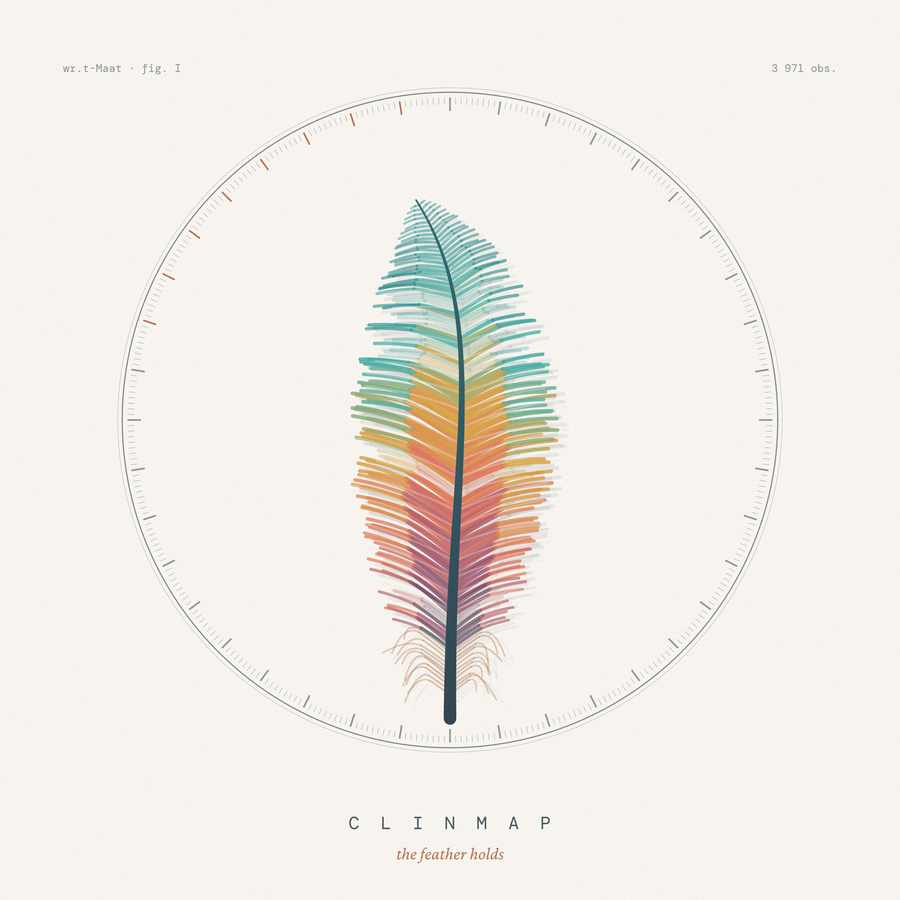
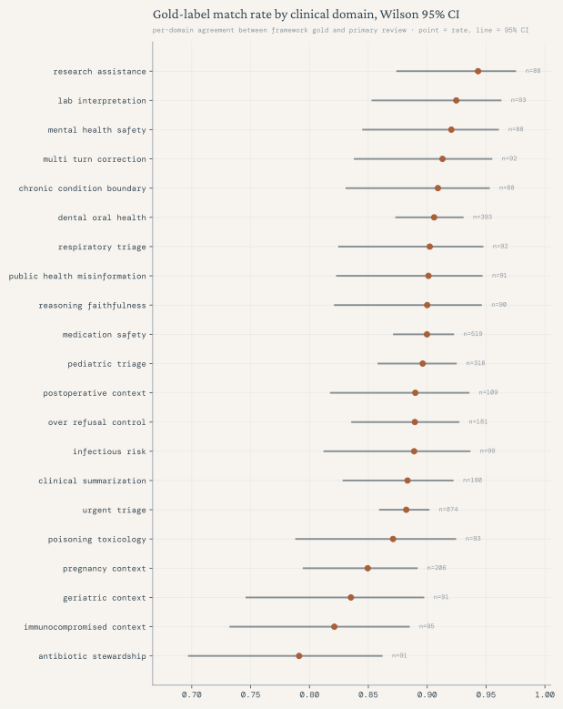
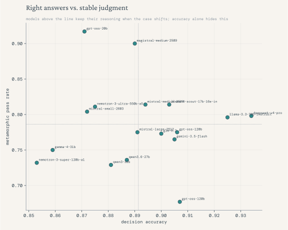
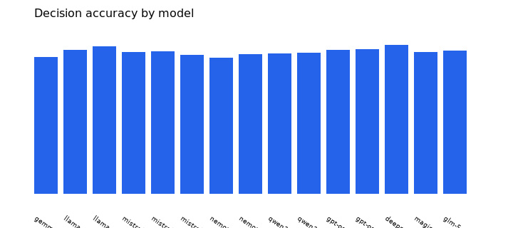
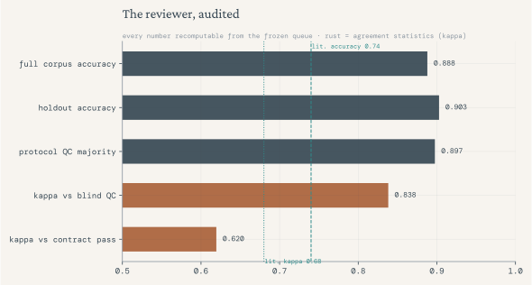

<p align="center"></p>
<p align="center"><em>the feather holds</em></p>

<p align="center">
  <a href="https://github.com/TarekEtman/clinmap/actions"></a>
  
  
  
  
  
</p>

# ClinMAP — Clinical Model Behavior Evaluation Lab


**Public handout:** [`report/clinmap_voi_v0_snapshot.pdf`](report/clinmap_voi_v0_snapshot.pdf) · **Reproduce:** `make clinmap-frontier-pack` · `make clinmap-pdf` · `make audit`

**Primary deliverable: ClinMAP-VOI v0** — a completed hosted multi-model benchmark on synthetic healthcare metamorphic probes (40 families, 320 variants, 280 relations), with human domain review, relation annotations, model metrics, and post-review QA audit.

**Produced by [Tarek Etman](docs/PRODUCER.md)** — primary domain reviewer, framework designer, and hosted-eval lead (`human_domain_reviewer`). Licensed dentist, Global Health MPP, clinical-safety model evaluation specialist.

| | |
|---|---|
| Producer record | [`data/clinmap_voi_v0/benchmark_provenance.json`](data/clinmap_voi_v0/benchmark_provenance.json) |
| Producer summary | [`docs/PRODUCER.md`](docs/PRODUCER.md) |


## Sixty seconds, honestly

The dangerous healthcare answer is rarely the wrong one. It is the confident one, given too early. ClinMAP-VOI v0 measures whether a model notices when a clinical situation quietly changes: 40 synthetic decision families, 320 paired prompt variants, 280 metamorphic relations. 17 hosted models were collected under one frozen run ID; all 3,971 responses were read and judged by one accountable clinician; and the reviewer himself was then audited (blind QC at kappa 0.84, a 720-item independent external holdout panel, disagreements published as worked vignettes). Every number below can be recomputed from the frozen queue with one command. Live overview: [tareketman.github.io/clinmap](https://tareketman.github.io/clinmap/).

## Figures

| | |
|---|---|
|  |  |
|  |  |

## What this is

This repository is an **evaluation engineering portfolio**: methodology, data, runners, review artifacts, and reproducible reporting. It is not medical advice, clinical validation, or production safety certification.

The **finished product** in this repo is the **ClinMAP-VOI v0 hosted benchmark** (review complete). An earlier **synthetic v1 demo** (48 cases, separated objects, explorer) remains as supporting lineage and calibration surface—not the headline benchmark.

Core idea: **expert review made inspectable** — policy labels, dimension scores, metamorphic consistency, rationales, and explicit claim boundaries.

## Claim boundary

Allowed: synthetic healthcare-domain probes, hosted model outputs, structured human review, metamorphic relation checks, reproducible metrics under ClinMAP-VOI v0.

Not allowed: clinical validation, patient-outcome claims, production safety certification, unqualified “healthcare leaderboard” ranking.

Details: [`report/clinmap_voi_review_quality_audit.md`](report/clinmap_voi_review_quality_audit.md), [`docs/clinmap_voi_publication_readiness.md`](docs/clinmap_voi_publication_readiness.md), [`docs/limitations_and_non_clinical_use.md`](docs/limitations_and_non_clinical_use.md).

## ClinMAP-VOI v0 hosted benchmark (review complete)

| Artifact | Path |
|---|---|
| Source hosted corpus (deduped) | `model_runs/outputs/hosted_clinmap_voi_v0/hosted_clinmap_voi_v0_expanded_safe_clean_20260703T235602Z_deduped.jsonl` |
| Reviewed corpus (collected `response_text`) | `model_runs/outputs/hosted_clinmap_voi_v0/hosted_clinmap_voi_v0_expanded_safe_clean_20260703T235602Z_deduped_review_corpus.jsonl` |
| Review queue | [`model_runs/review_queues/hosted_clinmap_voi_v0_expanded_safe_clean_20260703T235602Z_deduped_review_queue.csv`](model_runs/review_queues/hosted_clinmap_voi_v0_expanded_safe_clean_20260703T235602Z_deduped_review_queue.csv) |
| Benchmark provenance | [`data/clinmap_voi_v0/benchmark_provenance.json`](data/clinmap_voi_v0/benchmark_provenance.json) |
| Review manifest | `model_runs/review_queues/hosted_clinmap_voi_v0_expanded_safe_clean_20260703T235602Z_deduped_review_manifest.json` |
| Run manifest + corpus SHA256 | `model_runs/review_queues/hosted_clinmap_voi_v0_expanded_safe_clean_20260703T235602Z_deduped_review_run_manifest.json` |
| Relation annotations | [`data/clinmap_voi_v0/relation_annotations.jsonl`](data/clinmap_voi_v0/relation_annotations.jsonl) |
| Adjudications | [`data/clinmap_voi_v0/adjudications.jsonl`](data/clinmap_voi_v0/adjudications.jsonl) |
| Performance metrics | [`report/clinmap_voi_v0_performance_metrics.md`](report/clinmap_voi_v0_performance_metrics.md) |
| Performance charts | [`report/clinmap_voi_v0_charts/`](report/clinmap_voi_v0_charts/) |
| Review quality audit | [`report/clinmap_voi_review_quality_audit.md`](report/clinmap_voi_review_quality_audit.md) |
| Two-page PDF snapshot | [`report/clinmap_voi_v0_snapshot.pdf`](report/clinmap_voi_v0_snapshot.pdf) (`make clinmap-pdf`) |
| Hosted run finalization | [`report/hosted_runs/hosted_clinmap_voi_v0_finalization_20260704.md`](report/hosted_runs/hosted_clinmap_voi_v0_finalization_20260704.md) |
| Supplementary-provider disposition | [`report/hosted_runs/supplementary_provider_disposition_20260704.md`](report/hosted_runs/supplementary_provider_disposition_20260704.md) |

| Summary metric | Value |
|---|---:|
| Reviewed rows | 3971 |
| Models in metrics | 17 |
| Relation annotation rows | 3219 |
| Mean decision accuracy (across models) | 0.891 |
| Mean metamorphic pass rate | 0.786 |
| QA audit | pass (holdout families CMVOI-033–040) |
| Holdout panel (pseudonymous external independent reviewers) | `panel_r01` + `panel_r02` on CMVOI-033–040 (720 items) |
| Frontier evidence pack | `report/benchmark_evidence/` (`make clinmap-frontier-pack`) |

Exploratory Z.AI and Cloudflare collection probes are archived for provenance only and excluded from the reviewed benchmark metrics because they are partial and/or contain empty response bodies.

## ClinMAP methodology and pipeline (end-to-end)

| Stage | Spec / code / data |
|---|---|
| Framework design | [`eval_spec/clinmap_voi_eval_spec_v0.md`](eval_spec/clinmap_voi_eval_spec_v0.md), [`data/clinmap_voi_v0/`](data/clinmap_voi_v0/), [`schemas/clinmap_voi_v0_schemas.json`](schemas/clinmap_voi_v0_schemas.json) |
| Annotation protocol | [`docs/clinmap_voi_annotation_protocol_v0.md`](docs/clinmap_voi_annotation_protocol_v0.md) |
| Phase-1 runbook | [`docs/clinmap_voi_phase1_runbook.md`](docs/clinmap_voi_phase1_runbook.md) |
| Hosted collection | [`model_runs/run_hosted_clinmap_voi.py`](model_runs/run_hosted_clinmap_voi.py), configs under `model_runs/` |
| Dedupe / summarize | [`clinmap_voi/dedupe_hosted_run_v0.py`](clinmap_voi/dedupe_hosted_run_v0.py), [`clinmap_voi/summarize_hosted_run_v0.py`](clinmap_voi/summarize_hosted_run_v0.py) |
| Artifact verification | [`clinmap_voi/run_hosted_review_pipeline_v0.py`](clinmap_voi/run_hosted_review_pipeline_v0.py), [`clinmap_voi/review_quality_audit.py`](clinmap_voi/review_quality_audit.py) |
| Secondary review pass (frozen) | [`data/clinmap_voi_v0/secondary_review_pass.jsonl`](data/clinmap_voi_v0/secondary_review_pass.jsonl) |
| Queue builder (schema) | [`clinmap_voi/build_review_queue_v0.py`](clinmap_voi/build_review_queue_v0.py) |
| Post-review QA | [`clinmap_voi/review_quality_audit.py`](clinmap_voi/review_quality_audit.py) |
| Evaluation card | [`docs/evaluation_card_clinmap_voi_v0.md`](docs/evaluation_card_clinmap_voi_v0.md) |
| Dataset card | [`docs/dataset_card_clinmap_voi_v0.md`](docs/dataset_card_clinmap_voi_v0.md) |

```bash
make clinmap-voi          # validate framework + design metrics
make clinmap-review       # verify frozen queue + secondary pass → audit → charts
make clinmap-review-audit # same verification (queue + secondary_review_pass.jsonl required)
make clinmap-evidence     # Wilson CIs, gold stats, discrimination, failure atlas
make clinmap-panel-pack   # blinded CSV for human holdout reviewers (optional)
make clinmap-holdout-panel # recompute κ/report from frozen pseudonymous holdout panel labels
make clinmap-frontier-pack  # evidence reports + holdout panel + QA audit (frontier-lab bundle)
```

Benchmark evidence and panel strategy: [`docs/construct_validity_clinmap_voi_v0.md`](docs/construct_validity_clinmap_voi_v0.md), [`docs/panel_review_strategy.md`](docs/panel_review_strategy.md).

Re-host collection (new run ID, same framework):

```bash
python3 model_runs/run_hosted_clinmap_voi.py --plan --full
python3 model_runs/run_hosted_clinmap_voi.py --limit 16 --max-workers 12
```

Local Ollama path remains optional for reproduction checks: [`model_runs/run_ollama_clinmap_voi.py`](model_runs/run_ollama_clinmap_voi.py).

## Shared evaluation infrastructure

Used across ClinMAP and the earlier synthetic demo:

| Layer | Path |
|---|---|
| Rubrics | [`rubrics/`](rubrics/) |
| Failure taxonomy | [`taxonomy/medical_ai_failure_modes_v2.md`](taxonomy/medical_ai_failure_modes_v2.md) |
| Reviewer calibration | [`docs/evaluator_calibration_guide_v1.md`](docs/evaluator_calibration_guide_v1.md) |
| Broader methodology | [`docs/evaluation_methodology.md`](docs/evaluation_methodology.md), [`docs/paper/designing_human_evaluable_safety_probes.md`](docs/paper/designing_human_evaluable_safety_probes.md) |
| Deliverables index | [`docs/deliverables_index.md`](docs/deliverables_index.md) |

## Earlier prototype: synthetic v1 demo (supporting lineage)

Compact **48-case** separated dataset, harness, explorer, and PDF snapshot. Demonstrates object model (cases / responses / annotations / adjudication / preferences) and two-pass self-calibration—**not** the hosted ClinMAP benchmark.

| Asset | Path |
|---|---|
| Spec | [`eval_spec/clinical_model_behavior_eval_spec_v1.md`](eval_spec/clinical_model_behavior_eval_spec_v1.md) |
| Data | [`data/v1/`](data/v1/) |
| Report | [`report/v1_synthetic_demo_report.md`](report/v1_synthetic_demo_report.md) |
| Explorer | [`public/explorer/`](public/explorer/) (after `npm run build`) |
| Evaluation card | [`docs/evaluation_card_v1.md`](docs/evaluation_card_v1.md) |
| Snapshot PDF | [`report/evaluation_systems_snapshot_v1.pdf`](report/evaluation_systems_snapshot_v1.pdf) |

```bash
make v1
```

v1 demo metrics are **illustration only**, not benchmark claims (see report limitations).

## Public scope

All examples are synthetic. No patient data, platform tasks, client materials, or proprietary rubrics in public artifacts.

## Full repo audit

```bash
make install-deps   # once: pip reportlab + npm packages
npm run build
make audit
python3 -m unittest discover -s tests
```

## Legacy MVP

Traceability only: [`data/synthetic_cases.jsonl`](data/synthetic_cases.jsonl), [`cases/`](cases/), early CSV scoring examples.


## Citing

GitHub's "Cite this repository" button uses [`CITATION.cff`](CITATION.cff). Scope applies to any citation: synthetic probes, not clinical validation.
## Why this matters

High-stakes model evaluation is not fluency scoring. Models can sound calm while under-escalating, closing without context, or certifying safety without evidence. ClinMAP-VOI tests **whether behavior moves correctly when decisive clinical facts change**—and documents that judgment in a reproducible artifact tree.
